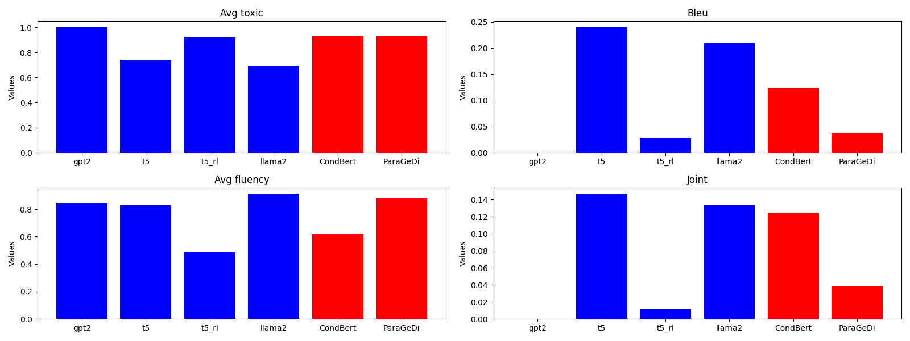

# Text Detoxification using finetuned Transformers
**One line of code rewrites the text to non-toxic!**
<p align="center">

</p>

## Description
This repo summarizes my montly mini-research on the text detoxification possibilities using transformers tuning. It containts many notebooks with experiments and final implementations of tools, both in Python and in CLI! One could find all the pretrained models, as well as my modified dataset on my [huggingface profile](https://huggingface.co/domrachev03). 

This investigation mostly extends [this research](https://github.com/s-nlp/detox). At least the evaluation and the dataset were taken (and modified) from there, and I highly suggest to familiarize yourself with this repo, if you are interested in topic! 

This is my first ML-related project, so I'm open to any comments and suggestions!

## Structure

```bash
.
├── data
│   ├── models_test_data        # The results of inference of all models on the test dataset
├── environment.yml             
├── notebooks                   # Research notebooks
├── README.md
├── reports
│   ├── final_solution.md       # Report, covering details about training best solutions
│   └── research_summary.md     # Report, covering whole investigation process with lots of details & visuals
├── requirements.txt
├── src
│   ├── data                    # Dataset classes
│   ├── metrics                 # Metrics used for model's performance evaluation
│   ├── models                  # Best models implementation, each contains code for running train & validation
│   │   ├── llama               
│   │   └── t5_small
│   └── visualization
└── TASK_DESCRIPTION.md
```

## Models
> You can find example usage in [final_solution.ipynb](notebooks/4.0-final_solution.ipynb)!

### T5-small
<p align="center">

</p>

The best among all other models turned out to be T5-small -- 60M parameters almost outperformed all the other models! It combined almost instant inference and great performance, resulting in one of the best options one might choose!

### LLama2-7b 
<p align="center">

</p>
This emerged as a fun experiement... but turned out to be quite an alternative. It shows worse performance regarding the metrics, however human evaluation shows that it's predictions are much more fluent and human-like (despite sometimes still toxic). 

Using the prompt: `You are a Twitch moderator that paraphrases sentences to be non-toxic.`, it shows results quite close to the state-of-art solutions, which I find very funny :^)

Worth mentioning, that the tuning process was performed via [modal.com](https://modal.com) -- a new startup, providing extremely convinient cloud solutions for ML-related tasks. You can see a one-liner running the image in cloud and generating an answer!

Moreover, this model was tuned only a little bit and on a small chunk of the data. Further tuning might show state-of-art results, so either donate me A100 80gb, or go and [try to tune it yourself](https://huggingface.co/domrachev03/llama2_7b_detoxification)!


### Worth mentioning
1. **Reinforcement learned t5-small**
The idea to launch a t5-small finetuning using library TRL (Transformer Reinforcement Learning) was very promising.

Using as a reward the direct evaluation of generated results, and the opportunity to finetune the deployed model using user feedback sounded intriguing... but I failed to finalize it. At least there are some results, but it turned out very hard to find a balance in reward function to make it work. You might familiarize yourself with results [there](notebooks/2.2-t5_RL_tuning_n_inference.ipynb). 
3. **GPT2**
Not worth mentioning, actually, GPT2 failed this task completely in my case. I accept that I might treated it in a wrong way, but I spend way too much time debugging this bro to give him any other chance.

### Comparison with other models
Here you can check the comparison with other baseline models, described [there](https://github.com/s-nlp/detox):
<p align="center">

</p>

## Installation
**Linux:**
```bash
git pull https://github.com/domrachev03/text_detoxification/
```
and make sure to install [dependencies](#depenencies)

## Dependencies
The main dependencies are:
1. `modal`
2. Huggingface modules: `transformers`, `datasets`, `trl`, `bitsandbytes`
3. Terminal utils: `huggingface-cli`, `unzip`
4. Some models, ex. LLAMA2, would not even start launching without `cuda`

For the convenience, all the dependencies are provided in the `requirements.txt` and `environment.yml`. 
> *Note.* Some Jupyter notebooks have cells, which install the specific versions or specific packages.


## Acknowledgement
I would like to thanks the team of Practical Machine Learning and Deep Learning course for such a great opportunity to explore the world of Natural Language Processing. Special thanks to Vladimir Ivanov and Maxim Evgragov for tutorship and answering my (usually stupid) questions.
