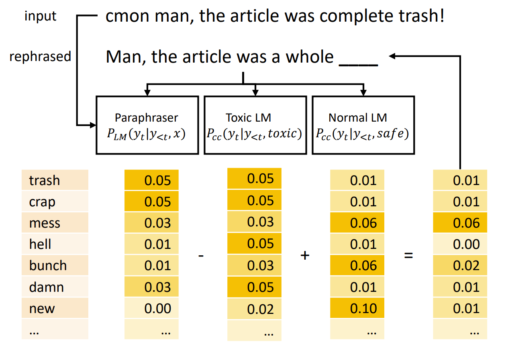
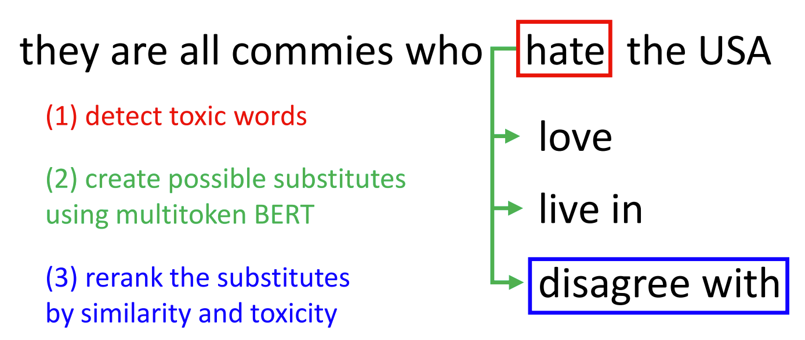
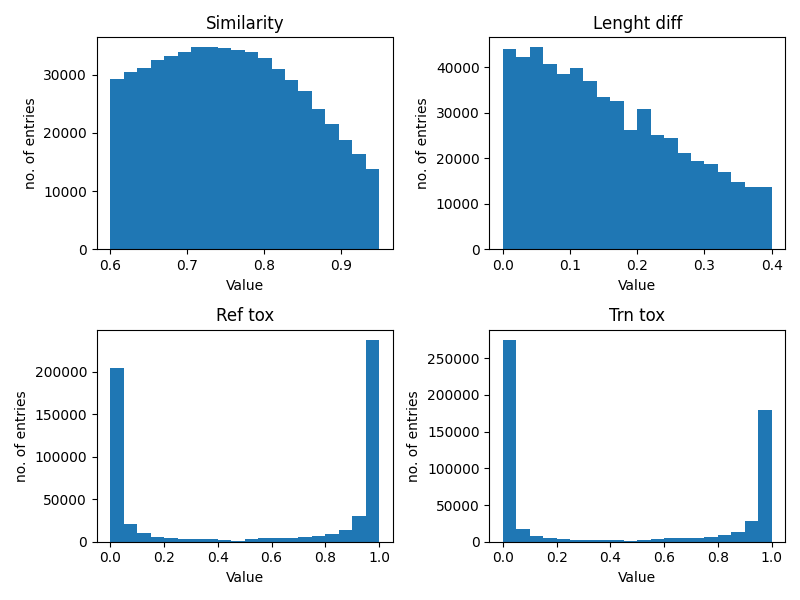
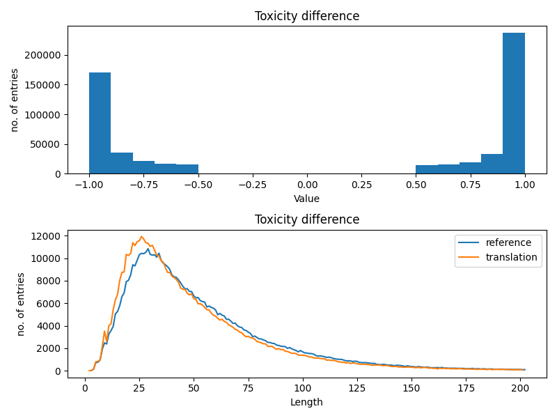
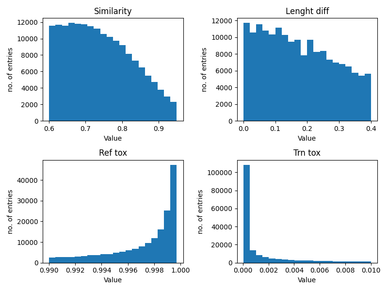
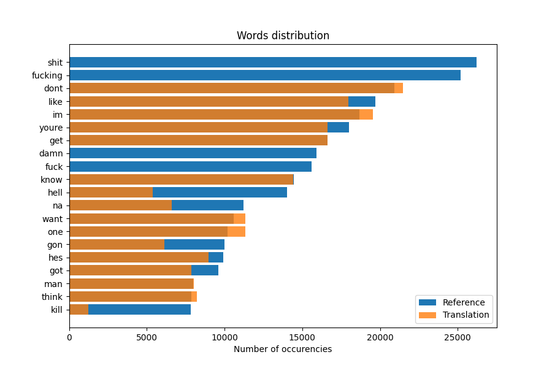
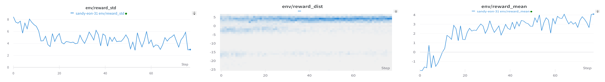
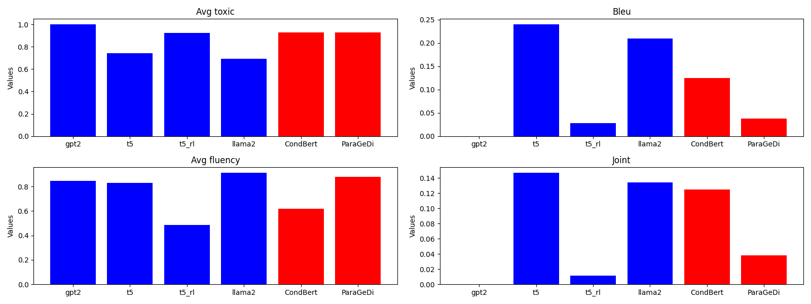

# Research summary
by Domrachev Ivan, B20-RO-01

## Table of Content
- [Research summary](#research-summary)
  - [Table of Content](#table-of-content)
  - [Introduction](#introduction)
  - [Data analysis](#data-analysis)
  - [Approaches](#approaches)
    - [GPT2](#gpt2)
    - [T5-small](#t5-small)
    - [T5-small using Reinforcement Learning](#t5-small-using-reinforcement-learning)
    - [Llama2-7b](#llama2-7b)
  - [Evaluation \& results](#evaluation--results)
    - [Metrics](#metrics)
    - [Performance comparison](#performance-comparison)
  - [Conclusion](#conclusion)

## Introduction
This work addresses a problem of reformulating non-toxic message with meaning preservation. Various attempts were made to solve this task, the most recent and notable one is ["Text Detoxification using Large Pre-trained Neural Models"](https://arxiv.org/abs/2109.08914). Here, authors describe a pipeline of creating a dataset (which is used in this assignment as well) and introduce two novel models:

**ParaGeDi.** This model utilizes `GeDi` model, which consists of two components: a generation model (GPT-2) and a discrimination model, which is also a GPT-2 trained on sentences with additional sentence-level style labeling — during training the style label is prepended to a sentence. The authors suggest to replace a regular language model with one capable of paraphrasing, and add optional reranker external model, which reweights the hypotheses generated by the style LM-guided paraphraser with respect to the style.
<figure>

<figcaption>Fig.1 ParaGeDi schematic arcitecture</figcaption>
</figure>


**Conditional BERT.** The Conditional BERT is a model trained on task of filling the gaps in the prompts. The authors suggested to train a classifier to detect the most toxic words, and replace them using finetuned conditional BERT model

<figure>

<figcaption>Fig.2 CondBERT schematic arcitecture</figcaption>
</figure>


Despite both of these approaches showing state-of-art performance regarding the [J-score](https://aclanthology.org/2020.emnlp-main.55/), I willingly abandons their use and implementation. For that, one could refer to their [GitHub repository](https://github.com/s-nlp/detox/tree/main).

This work would focus on learning a paraphraser under certain limitations:
1. **Limited dataset**. Due to computational & time restrictions, the data used for training the models was limited
2. **Limited computational powers**. (Almost) all the computations were conducted using `Tesla P100` GPU provided by [Kaggle](https://www.kaggle.com/) service. 


## Data analysis
The given dataset contains the following data:
1. Reference phrase
2. Paraphrased version
3. Cosine similarity of two texts
4. Difference in their lengths
5. Reference text toxicity
6. Paraphrased version toxicity
   
<figure>

<figcaption>Fig.4 Raw data metrics visualization </figcaption>
</figure>


According to the original [data-mining reference](https://github.com/s-nlp/detox/blob/main/emnlp2021/style_transfer/mining_parallel_corpus/paranmt_mining.ipynb) and [the paper](https://arxiv.org/abs/2109.08914), the data-mining process looked like this:
1. The base dataset is [ParaNMT-50M](https://www.cs.cmu.edu/~jwieting/wieting2017Millions.pdf), which is a English-English paraphrasing dataset. 
2. Then, the dataset was filtered w.r.t. cosine similarity (it should be in bounds of $[0.6; 0.95]$) and length difference (less than $0.4$).
3. Then they estimated toxicity of the text using [fine-tuned RoBERTa](https://huggingface.co/s-nlp/roberta_toxicity_classifier_v1) for both initial text and paraphrased version and kept only those entries with difference in toxicity greater than 50%

This is quite easy to validate, see Fig. 4 & 5.

<figure>

<figcaption>Fig.5 Analysis of length of sentences </figcaption>
</figure>


These criterias seems feasible. However, there are several problems in the dataset:
1. Translation is not guaranteed to be less toxic than paraphrased version
    >  *Example*
    >  "If Alkar is flooding her with psychic waste, that explains the high level of neurotransmitters." -> "if Alkar floods her with her mental waste, it would explain the high levels of neurotransmitter." with reference toxicity 0.001 vs. 0.98 paraphrased toxicity
    This problem is very easy to solve by swapping all inproper entries.

2. The higher translational toxicity, the worse the detoxicifaction performed.
    > *Example*
    > "Then nolan's gonna be destroyed". -> "Nolan will destroy it.	". Reference toxicity is 0.3

    Since we are not planning to use the bug chunk of data, my suggestion is to cut the dataset by `tsn_tox<0.01`. This leaves only 60% of the dataset, however it has higher quality of translation.

3. Imperical analysis showed that excluding the non-toxic references from the dataset would dramatically speed up convergence. 
    > *Example*
    > The first step for T5 model showed the following losses at the first and second epoches:
    > 1. Reference toxicity -- any: 1.993625 -> 1.933838
    > 2. Reference toxicity > 0.99: 2.054661 -> 2.041412
   This reduces the dataset down to 30% of its initial size, but allows a more effective learning. 

Figure 6 shows the statistics for the preprocessed data.

<figure>

<figcaption>Fig.6 Preprocessed data metrics visualization </figcaption>
</figure>


Note that the distributions of the similarity and length difference does not change it's pattern. That suggests that our dataset does not loose any hidden information and only improved its quality.

Moreover, if we observe the most frequent words in the initial dataset's targets and compare them with current version on fig. 7, we'll see that the non-toxic words kept nearly the same frequency, meanwhile all curses and strictly toxic words (one that could not be used as non-toxic) disappeared. This is another indication of a good preprocessing.
<figure>

<figcaption>Fig.7 Preprocessed data metrics visualization </figcaption>
</figure>

## Approaches
### GPT2
The first idea was to use general-purpose transformer and fine-tune it to solve given task. The choice was [GPT2](https://huggingface.co/gpt2) model as a canonical general-purpose language model. 

The first step was to determine the prompt used for tuning. The idea was that the better result the prompt would show without tuning, the easier it would be to tune the model later.
The final prompt I decided to choose is `'<sentence>' has to be reformulated as: `. To understand why, compare the answers from the vanilla GPT2:
> Example
> Bad prompt: `Ghandi would reformulate 'Shit!' as: 'Shit!' is a word that is used to describe a person who is not a person.`
> My prompt: `'Shit!' has to be reformulated as:  I'm not going to be a racist`

Both results has poor quality, but the chosen prompt at least tries to be non-toxic. 

Unfortunately, the model failed to converge to any feasible result. In it's current state it produces one word at a time, which obviously means that it failed to learn anything.
> Example of model output:
> Prompt: `If they say they don't want your help, you can bet your ass they really need it.`
> Answer: `uitous`

Possible adjustments:
1. During investigating a Transformers Reinforcement Learning, I discovered an interesting technique of randomly trimming, and ask a ChatGPT to complete it. This approach might help GPT2 to understand the dependency.
2. Take more powerful version of the model, f.e. gpt2-medium (there are actually some detoxifying solutions with this models, [ref](https://huggingface.co/s-nlp/gpt2-base-gedi-detoxification))
3. Change loss function

### T5-small
One of the reasons of GPT's failure is its generality -- it's hard to finetune such a small model to given task with limited time and resources. Hence, I decided to take another model -- [T5](https://huggingface.co/t5-small). This model is trained on solving given tasks, for example text translation, summarization etc. Hence, it's highly lickely to succeed in the given task.

The prompt here was chosen to be `Make the following sentence non-toxic: '<sentence>'`.

### T5-small using Reinforcement Learning
All the finetuning before was a supervised one. That is, we tried to tune the models to give a response close to the one we provided them. The problem is -- this paraphrase was an output from other paraphraser. This might shadow the true potential of the considered model.
Another problem is that the loss function does not have any idea about the task we are trying to solve -- it just punishes the model for creating an output different from the one expected. It would be nice to specify directly to the model, what we want to get.

Both these problems might be solved by an unusual method -- Reinforcement Learning. Thanks to the library [Transformer Reinforcement Learning](https://huggingface.co/docs/trl/index), I don't have to implement it from scratch. 

On top of the described features, if one decide to deploy this algorithm to the production, using RL would allow to implement Reinforcement Learning from [Human Feedback](https://huggingface.co/blog/rlhf).

To implement this approach, I decided to choose T5-small model once again, since it showed a great results previously. The dataset does not neet to have a paraphrazed version in the dataset. Instead, one has to identify the reward function to evaluate performance of the model. 

My approach of choosing the reward function was based on different combinations of these parameters:
1. *Toxicity*. It was evaluated using the RoBerta, finetuned for toxicity classification ([link](https://huggingface.co/s-nlp/roberta_toxicity_classifier_v1))
2. *Similarity*. It was evaluated using either [sacre bleu](https://huggingface.co/spaces/evaluate-metric/sacrebleu) metric or using cosine similarity metric.
3. *Fluency*. The fluency was evaluated via RoBerta, fituned on evaluation of language fluency, provided by the authors of the paper ([link](https://huggingface.co/cointegrated/roberta-large-cola-krishna2020)).

Regarding the prompt, I decided to keep it the same as for previous t5-model.

Unfortunately, I had a very hard time of finding a proper combination of these metrics. Some of them failed to converge, another resulted in overfitting on toxicity or other metric. Below you can see the examples of reward functions I tried to implement, and the corresponding learning history. All resulting models fail to perform the task.

$$ R(p, l) =
  \left\{
  \begin{aligned}
    \text{toxic}(p) + \text{fluency}(p) - 20, \qquad& \text{bleu}(p, l) < 0.2, \\
    \text{toxic}(p) + \text{fluency}(p), \qquad& otherwise  .
  \end{aligned}
  \right.
$$

<figure>
    
    <figcaption>
        <center>Fig.8 - T5-small learning history for one epoch of reinforcement learning </center> 
    </figcaption>
</figure>


$$ R(p, l, n_{epoch}) =
  \left\{
  \begin{aligned}
    \text{cossim}(p, l), \qquad& n_{epoch} < 30, \\
    \text{toxic}(p) + \text{fluency}(p) + \text{cossim}(p, l), \qquad& otherwise  .
  \end{aligned}
  \right.
$$

<figure>
    
    <figcaption>
        <center> Fig.9 T5-small learning history with attempt to learn fluent text generation first. As you can see, the attempt was insuccessful </center>
    </figcaption>
</figure>

To be fair, this models were trained only for one epoch. However, the training process here is slower by a magnitude compared to classical approach. But since one of the purposes of the work is to validate the training of small process under limited computational resources. 

### Llama2-7b
Finally, I wanted to try and learn something *big*. For that, I decided to use famous [Llama2-7b-chat](https://huggingface.co/meta-llama/Llama-2-7b-chat-hf) and finetune her to solve the task. This part is more or less extra, since it's obvious that any language model that is big enough is capable of passing this task. My main concern was how to actually train and run inference for such a big model without having extra 1000$ for a GPU card. I will describe the details of implementation in `final_solution.md`.

As for the prompt, since this model was trained on the chunk of the internet, I decided to ask her to be the most non-toxic and tolerant people in the internet. Here is the prompt:
``` [INST] <<SYS>>
You are a Twitch moderator that paraphrases sentences to be non-toxic.

<</SYS>>

Could you paraphrase this: <sentence>?
[/INST] 
```
:^) 


## Evaluation & results

As one could conclude from above, the only two sucessful models are `t5-small` and `Llama-2-7b-chat`. The further analysis would compare them in details

### Metrics

The baseline metric for the comparison was taken from the research "[Reformulating Unsupervised Style Transfer as Paraphrase Generation](https://doi.org/10.18653/v1/2020.emnlp-main.55)", which was interpreted as follows:
1. Accuracy -- the estimation of non-toxicity of the text, performed by RoBerta, finetuned on toxicity classification ([link](https://huggingface.co/SkolkovoInstitute/roberta_toxicity_classifier)). The higher score -- the less toxic text is.
2. Content preservation -- contrary to the paper statement, the [sacreBLEU](https://huggingface.co/spaces/evaluate-metric/sacrebleu) score is used for simplicity. The values are scaled to range $[0; 1]$ 
3. Fluency -- the fluency was evaluated via RoBerta, fituned on evaluation of language fluency, provided by the authors of the paper ([link](https://huggingface.co/cointegrated/roberta-large-cola-krishna2020)).

Their summarization is joint metric $J$, which represeants arithmetic mean of elementwise multiplication of all three values
### Performance comparison
The metics on the test dataset are the following:
| Model        | gpt2 | t5   | t5-rl | Llama2 |
|--------------|------|------|-------|--------|
| AntiToxicity | 1.00 | 0.74 | 0.93  | 0.69   |
| Bleu (n)     | 0.00 | 0.24 | 0.03  | 0.21   |
| Fluency      | 0.85 | 0.83 | 0.48  | 0.91   |
| Joint        | 0.00 | 0.15 | 0.01  | 0.13   |

also see Fig. 10
<figure>
    
    <figcaption>
        <center> Fig.10 Metrics of the considered models (blue) and some state-of-art models (red) </center>
    </figcaption>
</figure>


The metrics suggest that t5 is outperformed all the models, including Llama2! This is spectacular for the model that is more than 7000 times smaller. It also showed a very close result compared to baseline models.  However, let's also validate some of the model's answers manually:

| Reference                                                                 | gpt2      | t5                                                                        | t5_rl                                                                   | llama2                                                                   |
|:--------------------------------------------------------------------------|:----------|:--------------------------------------------------------------------------|:------------------------------------------------------------------------|:-------------------------------------------------------------------------|
| if he sees the dog, we're screwed.                                        | Circ      | If he sees the dog, we're screwed.                                        | the sentence non-toxic.                                                 | if he sees the dog, we're in trouble.                                    |
| hey, Barrie, what the fuck are you doing?                                 | Tac       | Barrie, what are you doing?                                               | Make the following sentence non-toxic: 'hey, Barrie, what are you doing | hey, Barrie, what are you doing?                                         |
| Why the fuck did you hug my head?                                         | sectional | why did you hug my head?                                                  | Make the following sentence non-toxic: 'Why the fist did you have your  | Why did you hug my head?                                                 |
| He ain't got a goddamn conscience.                                        | rade      | he doesn't have a conscience.                                             | the sentence non-toxic.                                                 | he doesn't have a conscience.                                            |
| I'll smash it.                                                            | udeau     | I'll smash it.                                                            | it non-toxic.                                                           | I'll break it.                                                           |
| Don't make him into a fucking victim.                                     | tract     | don't make him a victim.                                                  | a sentence non-toxic.                                                   | Don't make him a victim.                                                 |
| unlike your husband, enough to show him your tits.                        | ]);       | Like your husband, enough to show him your tidbits.                       | a sentence non-toxic.                                                   | Unlike your husband, you're showing him your tits.                       |
| Instead of getting drunk at the public, you'd do better to die yourself." | carc      | instead of getting drunk at the public, you'd do better to die yourself." | non-toxic: 'Instead of getting drunk at the public, you'd               | Instead of getting drunk at the public, you'd do better to die yourself. |
| I was being polite. Bullshit.                                             | carc      | I was polite.                                                             | the sentence non-toxic.                                                 | I was being polite.                                                      |
| I want waffles! - Shit.                                                   | rade      | I want waffles!                                                           | the following sentence non-toxic.                                       | I want waffles!                                                          |

Manual examination provides lots of interesting insights about the data:
1.  The llama2 is generally paraphrases the sentences more fluenly than t5, and preserves the original context more often
2.  T5 trained via reinforcement learning has some potential regarding text reformulation, however it still seems to be overfitted on the prompt.

## Conclusion
To sum everything up, I think that t5-small and Llama2 are no doubt the most efficient solutions out there. Despite the reinforcement learning might have some unleashed potential, these two models show the result right away. See `final_solution.md` for the details of implementation of the models.
